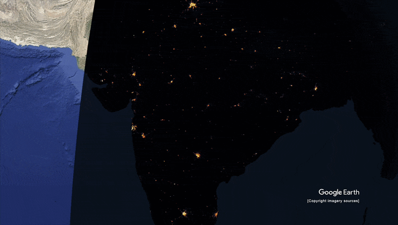

# Black Marble — India Nighttime Light Change 2014–2025




## Overview

This project visualizes over a decade of nighttime light change across India using NASA's Black Marble VIIRS dataset, processed in Google Earth Engine and animated in Google Earth Studio. Annual median composites are generated from NOAA's monthly VIIRS DNB data (2012–2025) in GEE, exported as GeoTIFFs & PNGs, and assembled into a globe animation in Google Earth Studio to try it out for the first time and play around with some animations.

Inspired by NASA's own Scientific Visualization Studio work on nighttime lights — shoutout to them for beating me to the punch. ([NASA SVS #5276](https://svs.gsfc.nasa.gov/5276/))

## Demo

**Live App:** [View Black Marble — India Nighttime Lights 2014–2025](https://ee-markolann.projects.earthengine.app/view/black-marble-india-nighttime-lights-2014-2025)

---

## Data Sources

- **NOAA VIIRS DNB Monthly Composites (VCMSLCFG):** Stray-light corrected, cloud-masked radiance data. Band used: `avg_rad` (nW/cm²/sr).
- **USDOS LSIB Simple 2017:** Country boundary dataset used to clip imagery to India.
- **Provider:** NOAA/NASA via Google Earth Engine.
- **Spatial Resolution:** 500m/px — optimized for regional-scale visualization.
- **Temporal Coverage:** April 2012 – 2025 (annual median composites).

---

## Methodology

### 1. Boundary Definition
India's geometry is pulled from the USDOS LSIB dataset and used to clip all imagery, keeping analysis within national borders.

### 2. Annual Median Compositing
For each year (2012–2025), monthly VIIRS images are filtered by calendar year and reduced with `.median()` to produce a single cloud-free annual composite, tagged with its year for export.

### 3. Visualization Parameters
A fixed color palette and min/max range (0–60 nW/cm²/sr) are applied consistently across all years, ensuring frame-to-frame comparability in the animation:
```
Palette: black → deep navy → orange → gold → white
Min: 0 | Max: 60 nW/cm²/sr
```

### 4. Export Pipeline
Annual composites are exported as RGB GeoTIFFs (palette baked in) and PNGs to Google Drive, suitable for direct use as overlay layers in Google Earth Studio. Had to convert to KML files and then connect those KML files to corresponding PNGs.

### 5. Animation in Google Earth Studio
Exported frames are imported as time-sequenced overlays on a 3D globe in Google Earth Studio to produce the final animated GIF.

---

## Setup & Usage

### Prerequisites
- A [Google Earth Engine](https://earthengine.google.com/) account.
- Google Drive storage for exported GeoTIFFs.
- (Optional) [Google Earth Studio](https://earth.google.com/studio/) for animation.

### Running the Script

1. Open the **GEE Code Editor**.
2. Paste `script.js` from this repository.
3. Click **Run** — the map will center on India and preview the 2025 composite.
4. Navigate to the **Tasks tab** and run all export jobs (one per year, 14 total for 2012–2025).
5. Download the exported GeoTIFFs from the `BlackMarble_India` folder in your Google Drive.

---

## Repository Contents

| File | Description |
|---|---|
| `script.js` | GEE script — annual compositing, visualization, and export |
| `nighttime-lights-india.gif` | Final animated output (2014–2025) |

> Images/GeoTIFF frames are not included in this repo. Run the export pipeline to generate them.

---

## Reflections

Nighttime lights are genuinely fun and easy to visualize in GEE — the data is clean, the palette is dramatic, and it renders beautifully. That said, getting the *animation* to meaningfully show change over time was a lot harder than expected. The difference between 2014 and 2025 is real, but it's subtle enough across a country the size of India that the eye struggles to catch it quickly in a looping GIF or video. I think this concept would land much harder zoomed into a single city, where growth and electrification would be harder to miss. Still, it was a great excuse to dig into Google Earth Studio — it took a little bit to learn the controls, but absolutely worth the effort for the globe presentation.

---

## Contact

**Mark Lannaman** — [LinkedIn](https://www.linkedin.com/in/mark-lannaman-177551184/)
